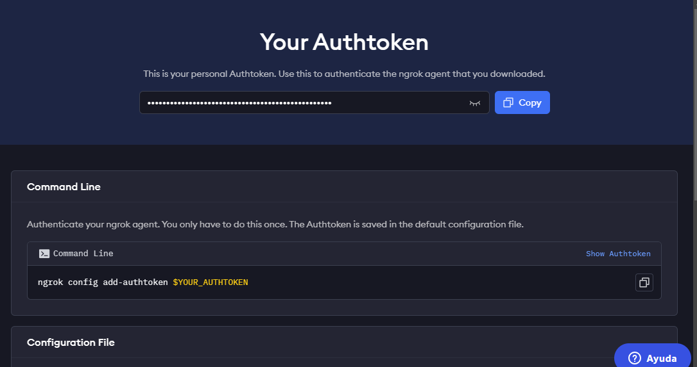
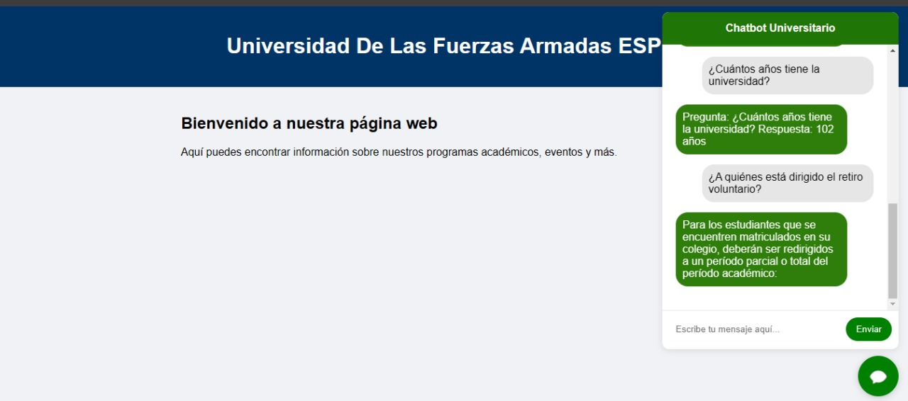

# PROYECTO FINAL CHAT-BOT FUNCIONAMIENTO 

## Integrantes:  Mateo Barriga, Christopher Bazurto, Yerli Reinozo 

### Intalacion: 

1. Dentro del proyecto podemos encontrar la base de datos que vamos a utilizar y nuestro modelo del chat-bot entrenado para que llegue a funcionar.

2. El nombre del archivo con el modelo entrenado es [**chatbot_model.joblib**](chatbot_model.joblib), para nostros poder llegar a generar este archivo usamos el archivo [**por_consola.ipynb**](por_consola.ipynb) en donde se llega a usar una base de datos vectorial y una modelo de google llamado Flan-T5 con eso llegamos a cargar y entrenar con la [**Base de datos**](Base_conocimiento_pre.xlsx). Se debe tener en cuenta para poder llegar el documento [**por_consola.ipynb**](por_consola.ipynb) instalar las siguientes librerias con los sigueintes comandos, se recomienda usar la el ID visual studio code: 

```
pip install faiss
pip install transformers 
pip install torch
```

3. Para la parte de nuestra visualzacion llegamos usamos [**Con_diccionario.ipynb**](Con_diccionario.ipynb), por cuestiones de recursos computaciones, el preferible usar la herramienta de Google [**Colab**](https://colab.research.google.com/) para tener que el codigo no llegue a dar errores en ningun entorno de desarrollo. 

4. Se debe tomar en cueta que al momento de correr el programa estamo usando una herramienta **ngrok** que este nor permite correr el programa en un ambiente local que nos ofrece la dicha aplicacion. Para poder llegar a acceder a esta se debe ingresar y registrar en la pagina para poder obtener el token que se va a utilizar en la siguinete linea: 
```
ngrok.set_auth_token('INGRESA_TU_TOKEN')
```
Enlace [**ngrok**](https://ngrok.com/)



5. Para la parte de la visualizacion llamamos a nuestra carpeta de templeates en donde manejaremos dos archivos uno para la parte del chat y la otra para el fondo. 
